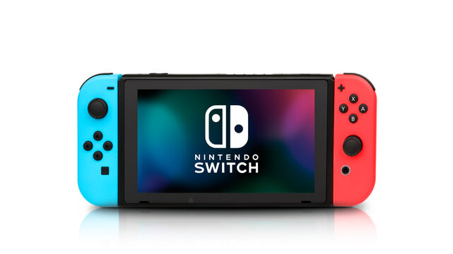

# Topics in CS - Assignment 1: About Me in GitHub

This is the first assignment for Topics in CS 2026

## Part 1 — The Basics

Answer each question using complete thoughts. You don't need to write an essay.

1. What is your name??
>Micah Wilson
2. What computer science class(es) have you taken before?
>The one with Mr. Warner
3. What is something you remember learning in computer science last year?
>Everything I curtrently know (Lets just say defining a function for the sake of the assignment though)
4. What is something from last year that you have mostly forgotten?
>I dont remember, I must have forgot it
5. Outside of school, what are you interested in?
>I want to take up sewing
6. What is something you're particularly good at — technology related or not?
>I can remember 99% of every video game or movie Ive ever played/Watched. In the Mario games I can remember where almost every secret is located.

## Part 2 — You and Computer Science

### Confidence Ratings

Using a scale of 1–5, rate your current confidence with each of these:

* Programing: 3
* Python: 3
* Debugging: 1
* Github: 1
* VS code: 5
* Working with files and folders: 5
* Using the terminal: 2
* Figuring something out when nobody gives you step-by-step instructions: 2

Then answer:

+ Which rating are you most confident about? Why?
>Probably VS code bc I use it at home to
+ Which rating do you most want to improve this year? Why?
>Github, because it sounds like you will make us use it a lot this year

## Part 3 — Pick Your Poison

### My Choices

For each pair, bold your choice.

Example:

**Python** or Java

Choose one:

+  **Python** or Java

+ **Mac** or PC

+ GUI or **Command Line**

+ Build something **useful** or build something ridiculous

+ Work **alone** or work with a team

+ **Hardware** or Software

+ Fix a bug or **start over**

+ **Google** it or figure it out yourself

+ **Game development** or AI

+ Cybersecurity or **Data Science**

## Part 4 — Your Technology

### Technology I Use

Answer the following:

+ What piece of technology do you use the most? Your answer can be hardware, software, an app, a website, a device, etc.
>I use my windows 10
+ What technology do you think is overrated? Explain.
>I dont really know... I dont use many diffrent things, I just stick to what I know
+ What technology do you wish existed? It can be realistic or completely ridiculous.
>Something that finds resepies online and gives you easy to follow/ understand steps
+ What is something computers are currently bad at?
>When I got my firse windows computer I prayed to whoever would listen that one day these things would have tutorials.
+ What is one technology-related issue you think people your age should care about?
>I dont know, I feel like there is an app for everything nowadays. Maybe wifi?

## Part 5 — Build Something

### My Project Idea

Imagine I gave you the rest of the semester and said:

*Build whatever you want.*

You have access to computers, the internet, programming tools, and reasonable school resources.

**What would you build?**

Describe:

+ What it would do
1. It would have a canender you can use to plan out asignments.
2. Have a study section where you can take questions and turn them into games (using AI)
3. Would contail all sorts of resources like Periodic tables, Formulas, Timelines, and other resourses like [Khan Academy](https://www.khanacademy.org/)
+ Who would use it
>*Everyone*
+ Why you would want to build it
>To make my homework easier
+ What you would need to learn in order to make it
>I would need to learn how to publish an app, how to update an app, And I would need to make an AI

*Don't worry about whether you currently know how to build it.*

---

## Part 6 — Prove You Know Markdown

Your document must contain all of the following:

+ At least three heading levels
>Check
+ Bold text
>Check
+ Italic text
>Check
+ A bulleted list
>Check
+ A numbered list
>Check
+ A blockquote
>Check
+ A link
>Check
+ An image
>Check
+ A horizontal rule
>Check
**Do not add these randomly at the bottom of the document.**

**Use them naturally throughout your responses.**

## Part 7 — Your Image

Find an appropriate image representing something you enjoy.

Save the image inside:

images/

Then display it in your README using Markdown.

Do not link directly to an image somewhere on the internet.

The actual image file should exist inside your repository.

## Part 8 — Git

You must make at least three commits while completing this assignment.

Do not write:

+ stuff

+ changes

+ update

+ asdf

+ Use commit messages that actually describe what you did.

    + For example:

        + Add initial questionnaire responses
        + Add technology section and formatting
        + Add image and finish README

## Part 9 — Push to GitHub

Your final repository on GitHub should contain:

topics-about-me/
├── README.md
└── images/
    └── your-image-file

Before submitting, open your repository on GitHub, not just VS Code.

Make sure:

+ Your README displays correctly.

+ Your image displays.

+ Your latest changes appear online.

+ Your commit history contains at least three commits.

## Final Question

At the very bottom of your README, add:

**Status Check**

+ What part of creating, committing, and pushing this repository was hardest for you today?

+ If nothing was difficult, explain the Git/GitHub workflow in your own words.

## Submission

+ Submit the URL to your GitHub repository.

+ Your grade is based primarily on successfully demonstrating that you can:

    + Organize files and folders

    + Write Markdown

    + Use VS Code

    + Use Git

    + Make meaningful commits

    + Push a repository to GitHub

    + Verify your work